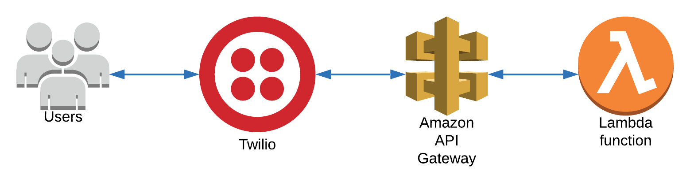

## SeekStore
This simple app receives a SMS message from Twilio and responds with a business associated to the message using the Yelp API.



### Setup
Requirements for this app includes:
- [AWS](https://aws.amazon.com/)
- [AWSCLI](https://docs.aws.amazon.com/cli/latest/userguide/cli-chap-install.html)
- [Twilio](https://www.twilio.com/try-twilio)
- [Yelp API](https://docs.developer.yelp.com/)

## Installation
First, create your accounts, grab the API key and clone this repository.
```
git clone https://github.com/percapio/seekstore.git
```

Inside <code>run.sh</code>, fill in the empty variables and run the script.
```
apikey=             # Your Yelp API key
appname=            # Name of the app
bucket=             # Name of your bucket
region=             # Name of your region of your bucket
```

Grab the Invoke URL from your AWS API Gateway Dashboard, add it to your Twilio Webhook URL and you're good to go.
https://www.twilio.com/docs/sms/tutorials/how-to-receive-and-reply-python-amazon-lambda
